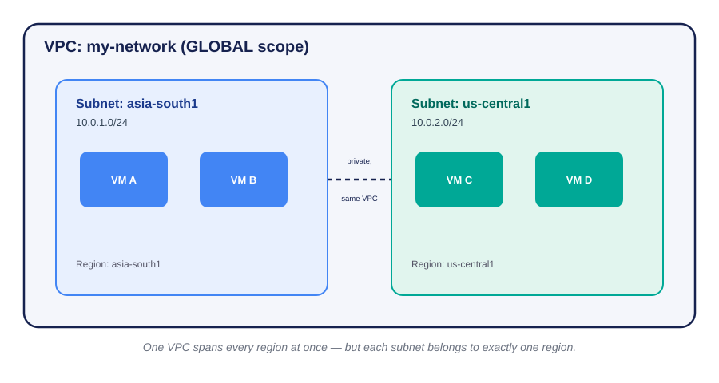
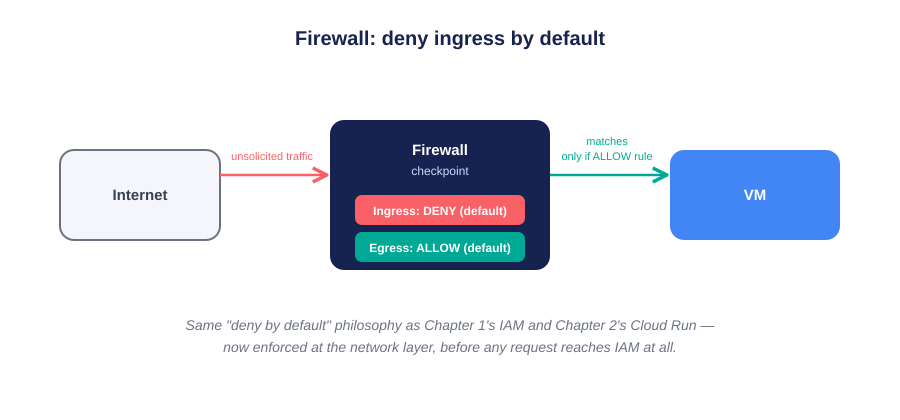
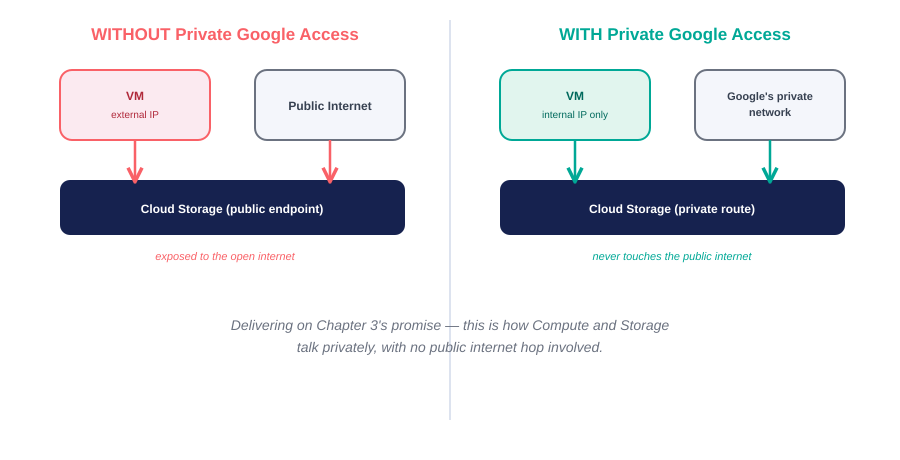
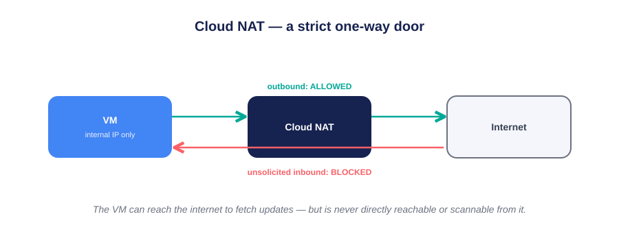
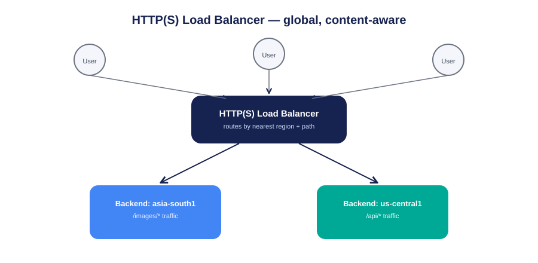
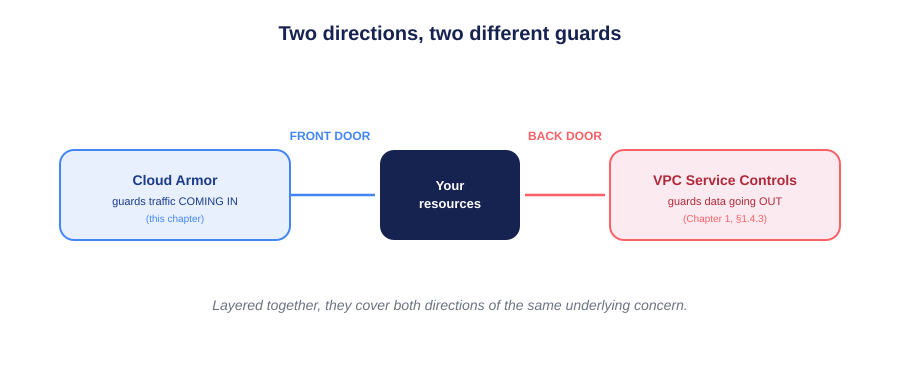

# 🌐 Chapter 4: Networking — GCP Deep Dive

> *"IAM decides who may act. Networking decides whether the traffic carrying that action can even arrive."*

[]()
[](https://cloud.google.com/vpc)
[]()
[]()
[]()

```
┌──────────────────────────────────────────────────────────────────────┐
│ CH.1 IAM & Storage → CH.2 Compute → CH.3 Storage & DB → CH.4 Networking (you) │
│ Cloud Storage        Cloud Run       Firestore           VPC, firewalls,     │
│ bucket                service         database            load balancers    │
└──────────────────────────────────────────────────────────────────────┘
```

**This is Chapter 4 of a self-directed GCP learning series.** Chapters 1–3 each proved least privilege on one resource type — storage, compute, a database. This chapter is the connective tissue: the layer that decides whether any of those resources can even be *reached*, by whom, and from where.

> **Note on this repo:** this chapter is documented in full theoretical depth here. The hands-on project — connecting the Chapter 2 Cloud Run service and Chapter 3 Firestore database privately, without public IPs — comes next, and screenshots will be added once that's built.

---

## 📖 Table of Contents
1. [The Layer Everything Sits On](#-the-layer-everything-sits-on)
2. [The Core Building Blocks](#-the-core-building-blocks)
3. [VPC & Subnets, Deep Dive](#-vpc--subnets-deep-dive)
4. [IP Addressing](#-ip-addressing)
5. [Firewall Rules, Deep Dive](#-firewall-rules-deep-dive)
6. [Routes](#-routes)
7. [Private Google Access & Private Service Connect](#-private-google-access--private-service-connect)
8. [Cloud NAT](#-cloud-nat)
9. [Connecting Networks](#-connecting-networks)
10. [Load Balancing, Deep Dive](#-load-balancing-deep-dive)
11. [Cloud DNS](#-cloud-dns)
12. [Cloud Armor & the VPC-SC Callback](#-cloud-armor--the-vpc-sc-callback)
13. [Core Principles](#-core-principles)
14. [FAQ](#-faq)
15. [Glossary](#-glossary)
16. [Self-Check Questions](#-self-check-questions)
17. [What's Next](#-whats-next)

---

---

## 🖼️ Diagrams in This Repo

| # | Diagram | Shows |
|---|---|---|
| 1 | `diagrams/01-vpc-subnets.svg` | A VPC's global scope vs. a subnet's regional scope |
| 2 | `diagrams/02-firewall-deny-default.svg` | Ingress denied, egress allowed, by default |
| 3 | `diagrams/03-private-google-access.svg` | Before/after: public exposure vs. private routing |
| 4 | `diagrams/04-cloud-nat.svg` | Outbound-only internet access for private VMs |
| 5 | `diagrams/05-load-balancer.svg` | Global, content-aware traffic routing |
| 6 | `diagrams/06-cloud-armor-vpcsc.svg` | Front-door vs. back-door protection |

---

## 🎯 The Layer Everything Sits On

Every chapter so far quietly depended on networking without naming it. The Chapter 2 Cloud Run service had a public URL. The Chapter 1 bucket and Chapter 3 Firestore database were reachable over the internet by default. Networking is what decides *how* and *whether* any of that traffic is allowed to move at all.

> **Analogy — a city's road system.** Compute instances and services are buildings. A **VPC** is the city itself. **Subnets** are individual roads in specific neighborhoods (regions). **Firewall rules** are checkpoints deciding which vehicles may enter which roads. **Routes** are the road signs telling traffic how to get from one building to another. Without any of this, buildings might exist — but nothing could reach them, or worse, everything could, with no checkpoints at all.

---

## 🧱 The Core Building Blocks

| Concept | What it is | Analogy |
|---|---|---|
| **VPC** | An isolated, private network within GCP, global in scope | The whole city |
| **Subnet** | A regional IP address range within a VPC | One road, in one neighborhood |
| **Firewall rule** | Allow/deny traffic by IP, tag, port, protocol | A checkpoint on a road |
| **Route** | Tells traffic how to reach a destination | A road sign |
| **Load Balancer** | Distributes incoming traffic across backends | A dispatcher at a busy intersection |
| **Cloud NAT** | Lets private resources reach the internet outbound | An unmarked delivery van, no return address |
| **Cloud DNS** | Translates names to IP addresses | The city's street directory |



---

## 🏙️ VPC & Subnets, Deep Dive

### A VPC is global; a subnet is regional
A single VPC can span every GCP region at once — but each subnet belongs to exactly one region. A VM in `asia-south1` and a VM in `us-central1` can share the *same* VPC, in *different* subnets, and still talk privately.

### Auto mode vs. Custom mode

| | Auto mode | Custom mode |
|---|---|---|
| Subnet creation | GCP creates one per region automatically | You create exactly what you want, where you want |
| IP ranges | Predetermined by Google | You choose the CIDR ranges |
| Best for | Quick experimentation, learning | Production — deliberate IP planning |

> **Worked example:** a learning project might use Auto mode since subnet planning isn't the point yet. A company running dev/staging/prod uses Custom mode specifically to avoid IP collisions when those networks are later peered together.

### ⚠️ The default VPC trap
Every new project ships with a **default VPC** — Auto-mode subnets, and a permissive internal firewall rule. Convenient for learning, but in production this is a starting point to lock down, echoing Chapter 1's warning about over-privileged default service accounts. **The pattern repeats: defaults favor convenience, least privilege favors deliberate configuration.**

---

## 📍 IP Addressing

| Type | Reachable from | Typical use |
|---|---|---|
| **Internal IP** | Only within the VPC (or peered/connected networks) | VM-to-VM, VM-to-database traffic |
| **External IP** | The public internet | A public-facing web server |
| **Ephemeral external** | Public internet, changes on restart | Short-lived, non-critical access |
| **Static external** | Public internet, fixed | DNS records, stable endpoints |

> **Delivering on Chapter 3's promise:** a Compute Engine VM with only an *internal* IP can still reach Cloud Storage or BigQuery through **Private Google Access** — no public IP, no public internet hop. This is the mechanism, explained below.

---

## 🔥 Firewall Rules, Deep Dive

GCP firewall rules are **stateful** (a reply to allowed traffic is auto-allowed back) and evaluated per-VPC.

| Attribute | Controls |
|---|---|
| Direction | Ingress or Egress |
| Action | Allow or Deny |
| Priority | Lower number = evaluated first |
| Target | VMs by network tag or service account |
| Source/Destination | Which IP ranges the rule applies to |



### ⚠️ The critical default
A VPC **denies all ingress by default** and **allows all egress by default**. This is the exact "deny by default" philosophy from Chapters 1 and 2 — now enforced at the network layer, *before* a request even reaches IAM or application-level checks.

### Targeting by tag vs. by service account

| | Network tags | Service account targeting |
|---|---|---|
| How applied | A text label on a VM | The VM's actual identity |
| Who can change it | Anyone with edit access to the VM | Requires elevated `iam.serviceAccountUser`-level control |
| Security implication | Weaker — tags are easy to add | Stronger — ties into Chapter 1's identity model |

> **Worked example:** a rule allowing SSH to VMs tagged `bastion` is easy to set up, but anyone who can edit a VM's tags can add themselves. A rule scoped to a specific service account is harder to casually expand — echoing Chapter 1's service-account discipline directly.

---

## 🗺️ Routes

Routes tell the VPC how to reach a destination IP range. GCP auto-creates a default internet route plus subnet routes for internal traffic. Custom routes matter when connecting on-prem networks or steering traffic through a network appliance.

> **Worked example:** a company routes all outbound traffic through a security-inspection VM by creating a custom route with higher priority than the default — inspecting traffic before it leaves the network.

---

## 🔒 Private Google Access & Private Service Connect



| | Private Google Access | Private Service Connect (PSC) |
|---|---|---|
| Connects to | Google's own public APIs | Google services, your own services, or partner services |
| Mechanism | Special routing for Google API IP ranges | A private IP endpoint inside your VPC |
| Best for | "Let my VM reach Cloud Storage privately" | Broader private service consumption, cross-project |

> **Worked example:** a Chapter 2 Cloud Run service reading from the Chapter 3 Firestore database, run from a VPC-connected environment with no public IP involved, is exactly the traffic Private Google Access is built for.

---

## 🚪 Cloud NAT

Lets **private-only VMs** (no external IP) initiate outbound internet connections — e.g., pulling OS updates — without exposing them to *inbound* internet traffic at all.



> **Worked example:** a database VM with only an internal IP needs periodic security patches. Cloud NAT provides that outbound path without ever giving the VM a scannable, attackable public IP.

---

## 🔗 Connecting Networks

| | VPC Peering | Shared VPC | VPN | Interconnect |
|---|---|---|---|---|
| Connects | Two separate VPCs | Multiple projects into one central VPC | GCP VPC ↔ on-prem, over internet (encrypted) | GCP VPC ↔ on-prem, dedicated private link |
| Typical use | Two orgs' GCP environments talking | One org's teams sharing central network infra | Cost-effective on-prem connectivity | High-throughput enterprise connectivity |

> **Worked example:** a company with separate "Networking" and "App Teams" projects uses **Shared VPC**, so App Teams' VMs live in a centrally-managed network — access to *use* it is itself an IAM grant (`roles/compute.networkUser`), tying back to Chapter 1 once again.

---

## ⚖️ Load Balancing, Deep Dive

| Type | Layer | Scope | Best for |
|---|---|---|---|
| **HTTP(S) LB** | Application (L7) | Global | Web apps, content-based routing |
| **TCP/SSL Proxy LB** | Transport (L4/L5) | Global | Non-HTTP TCP needing global reach |
| **Network LB** | Transport (L4) | Regional | Simple, high-performance regional traffic |
| **Internal LB** | Varies | Regional/global, internal-only | Traffic that should never leave the VPC |



> **Worked example:** a global e-commerce site uses an HTTP(S) Load Balancer for content-based routing (`/images/*` vs `/api/*`) across regions. An internal microservice that should never be public uses an Internal Load Balancer instead — access is scoped by network reachability, not just IAM.

---

## 🧭 Cloud DNS

A managed DNS service, with its own IAM controls (`roles/dns.admin`). **Public zones** are internet-resolvable; **Private zones** resolve only within your VPC — internal services get friendly names without any public exposure.

---

## 🛡️ Cloud Armor & the VPC-SC Callback

**Cloud Armor** provides DDoS protection and WAF rules at the load balancer layer — blocking malicious traffic before it reaches your backend.



> **Worked example:** a company under a volumetric attack configures Cloud Armor to rate-limit per IP — protecting the backend without touching IAM or firewall rules at all. This directly complements VPC Service Controls from Chapter 1: Cloud Armor guards the front door, VPC-SC guards the back door. Layered together, they cover both directions of the same underlying concern.

---

## 📐 Core Principles

1. **Deny-by-default applies at the network layer too** — ingress is blocked by default, echoing IAM's default-deny philosophy.
2. **A VPC is global; subnets are regional** — plan IP ranges deliberately in Custom mode beyond quick experimentation.
3. **Prefer private connectivity over public IPs** — Private Google Access and PSC let compute and storage talk without touching the public internet.
4. **Service-account-based firewall targeting beats tags** — it inherits Chapter 1's identity discipline instead of an easily-edited label.
5. **Different tools guard different directions** — Cloud Armor protects inbound; VPC-SC protects outbound. Neither replaces the other.
6. **The default VPC is a convenience, not a production posture** — the same lesson as Chapter 1's default service accounts.

---

## ❓ FAQ

**Q: If ingress is denied by default, how did my Chapter 2 Cloud Run service get a public URL?**
A: Cloud Run manages its own ingress separately from VPC firewall rules — its "Require authentication" setting (Chapter 2) is an IAM-layer control, not a firewall rule. The two systems solve related but distinct problems.

**Q: Do I need a VPC at all for something like Cloud Run or Firestore?**
A: Not by default — many serverless services run outside your VPC entirely. You only bring them into your VPC (via a Serverless VPC Access connector) when they need to reach private resources like a VM or a VPC-only database.

**Q: Is Private Google Access automatically on?**
A: No — it's a per-subnet setting you must explicitly enable.

---

## 📘 Glossary

- **CIDR range** — a notation for an IP address block, e.g. `10.0.1.0/24`.
- **Stateful firewall** — a firewall that automatically allows return traffic for a connection it already permitted outbound/inbound.
- **Ingress / Egress** — incoming traffic / outgoing traffic, relative to the resource.
- **Bastion host** — a deliberately exposed VM used as a controlled entry point into a private network.

---

## 🧠 Self-Check Questions

1. Why can a single VPC contain VMs in multiple regions, while a subnet cannot?
2. What's the default ingress behavior of a new VPC, and how does that philosophy echo Chapter 1?
3. How does Private Google Access let a VM reach Cloud Storage without a public IP?
4. Why is targeting a firewall rule by service account generally stronger than by network tag?
5. What's the practical difference between Cloud NAT and giving a VM a public IP directly?
6. When would a company choose Shared VPC over VPC Peering?
7. What's the difference between what Cloud Armor protects and what VPC Service Controls protect?

---

## 🔭 What's Next

The hands-on project for this chapter: connecting the Chapter 2 Cloud Run service and Chapter 3 Firestore database privately, without public IPs — proving these concepts the same way every prior chapter did, with a real denied and allowed test. Screenshots and a full walkthrough will be added here once that's built.

---

*Part of a self-directed GCP learning series — Chapter 1: [gcp-iam-least-privilege-lab](../gcp-iam-least-privilege-lab) · Chapter 2: [gcp-compute-least-privilege-lab](../gcp-compute-least-privilege-lab) · Chapter 3: [gcp-firestore-least-privilege-lab](../gcp-firestore-least-privilege-lab)*
